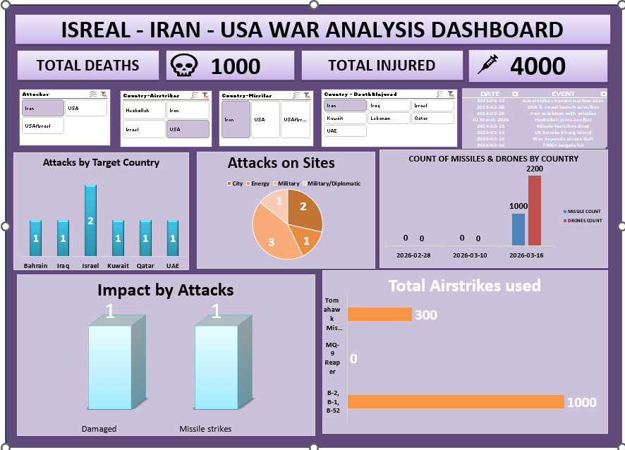

# 🌍 War Analysis Dashboard (Israel - Iran - USA)

## 📊 Dashboard Preview

---

## 📌 Overview

This project presents an **interactive Excel dashboard** analyzing war data between Israel, Iran, and the USA.

The dashboard helps in understanding:

* Total deaths and injuries
* Country-wise attacks
* Missile & drone usage
* Airstrike activity
* Timeline of major events

---

## 📈 Key Insights

* 📉 Total Deaths: 1000
* 🚑 Total Injured: 4000
* 🚀 High number of missile and drone attacks observed
* ✈️ Airstrikes mainly conducted using advanced aircraft

---

## ⚙️ Features

* ✅ Interactive filters (Country, Attacker)
* 📊 Visual charts (Bar Chart, Pie Chart, KPI Cards)
* 📅 Timeline tracking of events
* 📌 Clean and structured dashboard design

---

## 🛠 Tools Used

* Microsoft Excel
* Data Cleaning
* Data Visualization

---

## 📁 Files Included

* `conflict_dashboard_dataset 5.xlsx` → Dashboard & dataset
* `dashboard.png` → Dashboard preview image

---

## 🚀 How to Use

1. Download the Excel file
2. Open it in Microsoft Excel
3. Use filters and slicers to explore insights

---

## 📌 Project Purpose

This project is created for:

* 📊 Data Analyst Portfolio
* 📚 Practicing Excel dashboards
* 🎯 Showcasing data visualization skills

---

## 💡 Future Improvements

* Add more real-time data
* Convert dashboard into Power BI
* Improve UI/UX design

---

## ⭐ Support

If you like this project, give it a ⭐ on GitHub!

---
